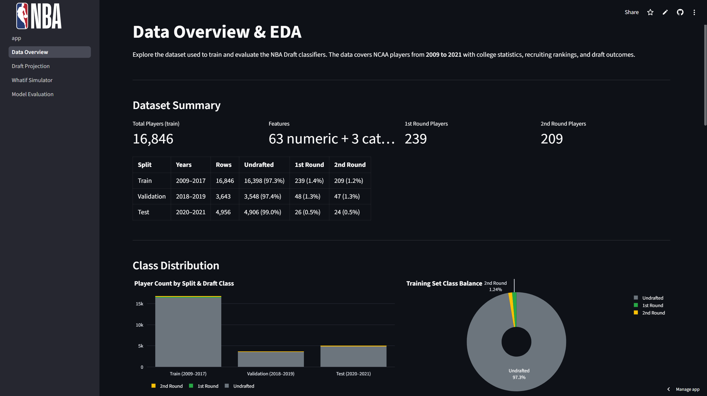
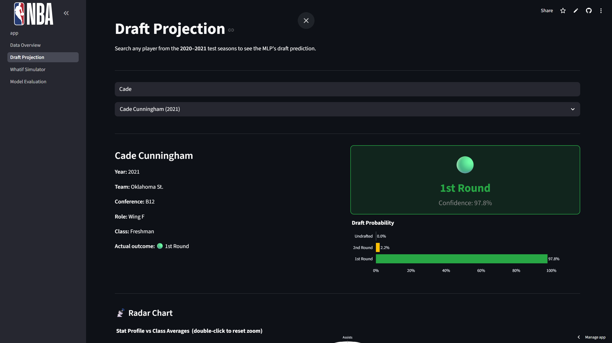
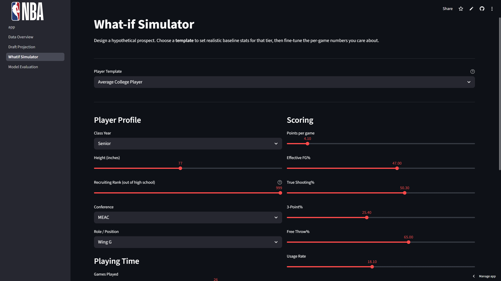
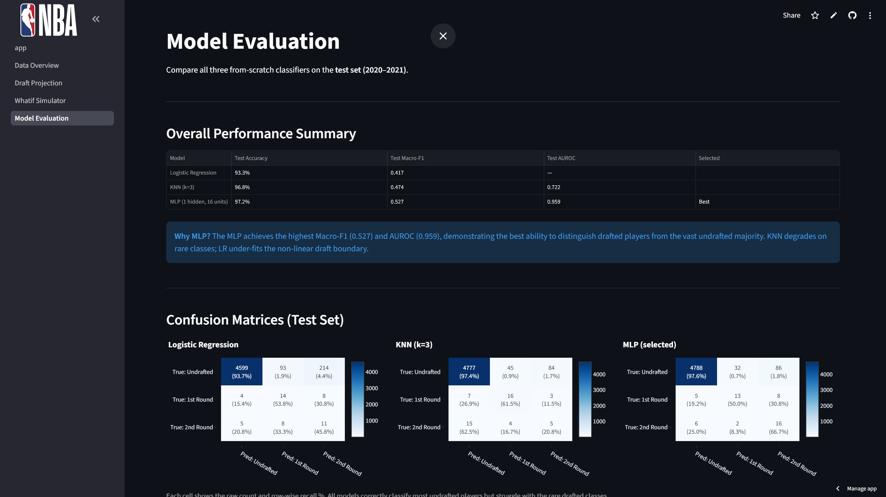

# NBA Draft Prediction from NCAA Player Statistics

A machine learning project that predicts whether an NCAA player will be **undrafted, selected in the first round, or selected in the second round** of the NBA Draft using public college basketball statistics.

This project was completed as a team project at **Cornell Tech**. This repository focuses on **my individual contributions: data ingestion, preprocessing, feature engineering, and Streamlit front-end development and integration**.

## My Contributions

### Data Pipeline

I developed the preprocessing pipeline used to transform raw NCAA player data into model-ready train, validation, and test datasets.

Key steps include:

- Merged NCAA player-season statistics with NBA draft outcomes.
- Cleaned inconsistent schema and player attributes.
- Parsed irregular height formats into standardized numeric values.
- Applied feature-specific missing-value handling rather than a single global imputation rule.
- Removed identifiers and columns that could introduce leakage.
- Created basketball-specific engineered features:
  - `Playmaker_Usg`
  - `Scoring_Gravity`
  - `AST_to_USG`
  - `Elite_Recruit`
  - `Freshman_Star`
- Created a chronological train / validation / test split for forward-looking evaluation.

The complete preprocessing workflow is available in [`notebooks/data_processing.ipynb`](notebooks/data_processing.ipynb).

### Streamlit Front End

I also developed and integrated the Streamlit front end for the team project. The application provided four main workflows:

- **Data Overview** — explore the NCAA dataset and draft-class distributions.
- **Draft Projection** — search historical players and inspect model-generated draft probabilities.
- **What-if Simulator** — adjust a hypothetical player's profile and examine how the prediction changes.
- **Model Evaluation** — compare classifier performance, confusion matrices, and per-class metrics.

The original deployment is no longer active, so screenshots are included below to demonstrate the interface and workflow.

> The Streamlit interface and application integration were part of my contribution. The underlying classifier implementations were developed by other team members and are not presented here as my individual work.

## Application Demo

### Data Overview

Explore the NCAA player dataset, class imbalance, and draft-related statistics.



### Draft Projection

Search a player and inspect the predicted draft class and class probabilities.



### What-if Simulator

Adjust a hypothetical player's profile and basketball statistics to explore how the predicted draft outcome changes.



### Model Evaluation

Compare the three team classifiers using overall metrics and confusion matrices.



## Team Modeling Results

The team compared three classifiers implemented from scratch:

| Model | Test Macro-F1 | Multiclass AUROC |
|---|---:|---:|
| Logistic Regression | 0.4427 | 0.9416 |
| K-Nearest Neighbors | 0.4702 | 0.7220 |
| **Multilayer Perceptron** | **0.5306** | **0.9520** |

The MLP achieved the strongest overall test performance and was selected for the final application.

Because the dataset is heavily imbalanced toward undrafted players, the project emphasized **Macro-F1, AUROC, and drafted-player recall** rather than accuracy alone.

> These model implementations were developed by other members of the team. They are summarized here to provide context for the full project and the application I integrated.

## Repository Structure

```text
nba-draft-prediction/
├── README.md
├── notebooks/
│   └── data_processing.ipynb
├── app/
│   ├── app.py
│   ├── utils.py
│   └── pages/
│       ├── 1_Data_Overview.py
│       ├── 2_Draft_Projection.py
│       ├── 3_Whatif_Simulator.py
│       └── 4_Model_Evaluation.py
├── assets/
│   ├── data_overview.png
│   ├── draft_projection.png
│   ├── what_if_simulator.png
│   └── model_evaluation.png
├── report/
│   └── final_report.pdf
└── requirements.txt
```

## Tech Stack

Python, Pandas, NumPy, Streamlit, Plotly, Matplotlib

## Project Context

The project uses public NCAA player statistics and NBA draft outcomes to study whether college performance can provide useful signals for draft screening.

The full team project explored logistic regression, K-nearest neighbors, and a shallow multilayer perceptron, along with threshold tuning for the highly imbalanced three-class prediction problem.

## Notes

- The original project dataset is not included in this repository.
- The original Streamlit deployment is no longer active.
- The screenshots represent the final team application interface.
- This repository is organized around my preprocessing and front-end/integration contributions rather than the full team codebase.

## Course

**INFO 5368-030: Practical Applications in Machine Learning**  
Cornell Tech
